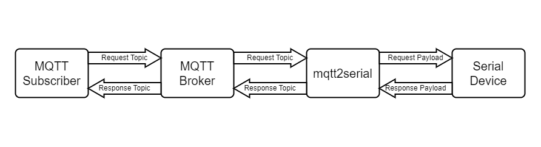

# mqtt2serial

## Architecture



## Build Image

amd64  
```shell=
$ docker build --no-cache -t mqtt2serial:1.0 .
```

arm64 (e.g. raspberry pi)  
```shell=
$ docker build --no-cache --build-arg GOARCH=arm64 -t mqtt2serial:1.0 .
```

## Environment Variable

| Key | Description | Example |
| - | - | - |
| MQTT_BROKER | MQTT Broker IP | 127.0.0.1 |
| MQTT_PORT | MQTT Broker Port | 1883 |
| MQTT_CLIENTID | MQTT Client ID | user |
| MQTT_RECEIVE_TOPIC | MQTT Request Topic | request |
| MQTT_SEND_TOPIC | MQTT Response Topic | response |
| SERIAL_PORT | Serial Port | /dev/ttyACM0 |
| SERIAL_BAUDRATE | Serial BaudRate | 9600 |

## Run  

```shell=
$ docker run -d --privileged -v <Serial Port>:<Serial Port> -e MQTT_BROKER=<Broker IP> -e MQTT_PORT=<Broker Port> -e MQTT_CLIENTID=<Client ID> -e MQTT_RECEIVE_TOPIC=<Request Topic> -e MQTT_SEND_TOPIC=<Response Topic> -e SERIAL_PORT=<Serial Port> -e SERIAL_BAUDRATE=<Serial BaudRate> mqtt2serial:1.0
```
